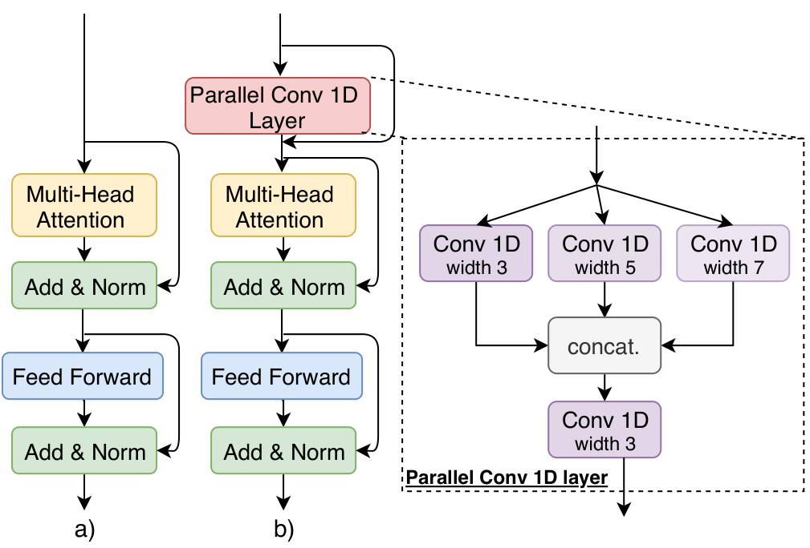

# A Convolutional Transformer for Character-Level Neural Machine Translation 

Code for the paper [Character-Level Translation with Self-attention](https://openreview.net/forum?id=BWlCpme3TS), ACL 2020. 

# Corpora and experiments

We test our model on two corpora:

- the [WMT2015 German - English datasets](http://www.statmt.org/wmt15/translation-task.html)
- the [United Nations Parallel Corpus (UNPC)](https://conferences.unite.un.org/UNCorpus/). Link to our data. 

# Preparations

## Install fairseq

We use [fairseq](https://github.com/pytorch/fairseq) ([Ott et al. in 2019](https://arxiv.org/abs/1904.01038)) as a base to implement our model. To install our fairseq snapshot, do the following:

```shell
cd convtransformer/

git clone https://github.com/pytorch/fairseq.git

cd ./fairseq/

pip install -r requirements.txt % install dependencies

python setup.py build % build fairseq

python setup.py develop
```

## Data preprocessing

We use [Moses](https://github.com/moses-smt/mosesdecoder.git) ([Koehn et al. in 2007](http://citeseerx.ist.psu.edu/viewdoc/download?doi=10.1.1.332.8432&rep=rep1&type=pdf)) to clean and tokenize the data, by appying the following scripts: 

``` shell
/mosesdecoder/scripts/tokenizer/remove-non-printing-char.perl

/mosesdecoder/scripts/tokenizer/tokenizer.perl

/mosesdecoder/scripts/training/clean-corpus-n.perl
```

## Converting Chinese texts to Wubi texts

To convert a text of raw Chinese characters into a text of corresponding Wubi codes, run the following commands:

```shell
cd /path/to/your/workspace/convtransformer/

python convert_text.py --input-doc /path/to/the/chinese/text --output-doc /path/to/the/wubi/text --convert-type ch2wb
```

The `convert_text.py` is available at https://github.com/duguyue100/wmt-en2wubi.

## Bilingual Training Data

To construct training sets for bilingual translation, run the following commands (example for UNPC French - English):

```shell
cd /path/to/your/workspace/UN-corpora/
cd ./en-fr

paste -d'|' UNv1.0.en-fr.fr UNv1.0.en-fr.en | cat -n |shuf -n 1000000 | sort -n | cut -f2 > train.parallel.fr-en

cut -d'|' -f1 train.parallel.fr-en > 1mil.train.fr-en.fr
cut -d'|' -f2 train.parallel.fr-en > 1mil.train.fr-en.en
```

## Multilingual Training Data

To construct training sets for multilingual translation, run the following commands (example for UNPC French + Spanish - English):

```shell
cat train.parallel.fr-en train.parallel.es-en > concat.train.parallel.fres-en

shuf concat.train.parallel.fres-en > shuffled.train.parallel.fres-en

cut -d'|' -f1 shuffled.train.parallel.fres-en > 2mil.train.fres-en.fres
cut -d'|' -f2 shuffled.train.parallel.fres-en > 2mil.train.fres-en.en
```

## Data Binarization

The next step is binarize the data. Example for UNPC French + Spanish - English: 

``` shell
mkdir /path/to/your/workspace/all-data/UN-bin/multilingual/fres-en/test-fr/
mkdir /path/to/your/workspace/all-data/UN-bin/multilingual/fres-en/test-es/

cd /path/to/your/workspcae/convtransformer/
```

**evaluation on French input** 

```shell
python preprocess.py --source-lang fres --target-lang en \
--trainpref /path/to/your/workspace/all-data/UN-processed/multilingual/fres-en/test-fr/2mil.train.fres-en/ \
--validpref /path/to/your/workspace/all-data/UN-processed/multilingual/fres-en/test-fr/2mil.valid.fres-en/ \
--testpref /path/to/your/workspace/all-data/UN-processed/multilingual/fres-en/test-fr/2mil.test.fres-en/ \
--destdir /path/to/your/workspace/UN-bin/multilingual/fres-en/test-fr/ \ 
--nwordssrc 10000 --nwordstgt 10000 
```

**evaluation on Spanish input**

```shell
python preprocess.py --source-lang fres --targe-lang en \
--trainpref /path/to/your/workspace/all-data/UN-processed/multilingual/fres-en/test-es/2mil.train.fres-en/ \
--validpref /path/to/your/workspace/all-data/UN-processed/multilingual/fres-en/test-es/2mil.valid.fres-en/ \
--testpref /path/to/your/workspace/all-data/UN-processed/multilingual/fres-en/test-es/2mil.test.fres-en/ \
--destdir /path/to/your/workspace/UN-bin/multilingual/fres-en/test-es/ \
--nwordssrc 10000 --nwordstgt 10000
```

# Convtransformer model 

The model is implemented [here](https://github.com/CharizardAcademy/convtransformer/blob/master/convtransformer/fairseq/models/transformer.py#L768). 

# Training

We train our models on 4 NVIDIA 1080x GPUs, using [Adam](https://arxiv.org/abs/1412.6980):  

```shell
CUDA_VISIBLE_DEVICES=0,1,2,3 python train.py /path/to/your/workspace/ \
--arch convtransformer --optimizer adam --adam-betas '(0.9, 0.98)' --clip-norm 0.0 \
--lr-scheduler inverse_sqrt --warmup-init-lr 1e-07 --warmup-updates 4000 --lr 0.0001 \
--min-lr 1e-09 --criterion label_smoothed_cross_entropy --label-smoothing 0.1 \
--weight-decay 0.0 --max-tokens 3000  \
--save-dir /cluster/scratch/username/checkpoints-conv-multi-fres-en/ \
--no-progress-bar --log-format simple --log-interval 2000 --allow_shortcut \
--find-unused-parameters --ddp-backend=no_c10d
```

where `--ddp-backend=no_c10d`  and `--find-unused-parameters` are crucial arguments to train the convtransformer model. You should change `CUDA_VISIBLE_DEVICES` according to the hardware you have available. 

# Inference

We compute BLEU using Moses. 

## Evaluation on test set

As an example, to evaluate the test set, run `conv-multi-fres-en.sh ` to generate translation files of each individual checkpoint. To compute the BLEU score of one translation file, run:

```shell
cd /path/to/your/workspace/geneations/conv-multi-fres-en/
cd ./test-fr/

bash geneation_split.sh

rm -f generation_split.sh.sys generation_split.sh.ref 

mkdir split

mv generate*.out.sys ./split/
mv generate*.out.ref ./split/

cd ./split/

perl multi-bleu.perl generate30.out.ref < generate30.out.sys
```

For`generation_split.sh`, copy the following content into the shell:

```shell
#!/bin/bash

function split_generations ()
{
  for file in `ls $1`
  do
    if [ -d $1"/"$file ]
    then
      readfile $1"/"$file
    else
      #echo $1"/"$file
      grep ^T $1"/"$file | cut -f2- | perl -ple 's{(\S)-(\S)}{$1 ##AT##-##AT## $2}g' > $1"/"$file.ref
      grep ^H $1"/"$file |cut -f3- | perl -ple 's{(\S)-(\S)}{$1 ##AT##-##AT## $2}g' > $1"/"$file.sys
   echo `basename $file`
   fi
  done
}

folder=`pwd`
split_generations $folder 
```

## Evaluation on with manual input

To generate translation by manually inputting the sentence, run:

```shell
cd /path/to/your/workspace/convtransformer/

python interactive.py -source_sentence "Violación: uso de cloro gaseoso por el régimen sirio." \ 
-path_checkpoint "/path/to/your/workspace/checkpoints-conv-multi-fres-en/checkpoint30.pt" \
-data_bin "/path/to/your/workspace/UN-bin/multilingual/fres-en/test-es/"
```

This will print out the translated sentence in the terminal. 

# Analysis

## Canonical Correlation Analysis

We compute the correlation coefficients with the CCA algorithm using the encoder-decoder attention matrix from the 6.th last model layer. 

An an example, to obtain the attention matrices, run:

```shell
cd /path/to/your/workspace/convtransformer/ 

bash attn_matrix.sh
```

For `attn_matrix.sh`, copy the following commands to the file:

```shell
#!/bin/bash

input="500-samples.fr"
linecount="0"
while IFS= read -r line
do
  python interactive.py -source_sentence "$line" -path_checkpoint "../cluster2local-new/checkpoints-bilingual-fr-en/checkpoint30.pt" -data_bin "../UN-bin/bilingual/fr-en/"
  echo "${linecount}"
  mkdir "sample_${linecount}"
  mv attention_*.pt "sample_${linecount}" 
  mv self-attention.pt "sample_${linecount}"
  linecount="$(($linecount + 1))"
done < "$input"
```

To compute the correlation coefficients, run:

```shell
cd /path/to/your/workspace/

python cca.py -path_X "/path/to/the/bilingual/attention/matrix/" -path_Y "/path/to/the/multilingual/attention/matrix/"
```

# Citation 
