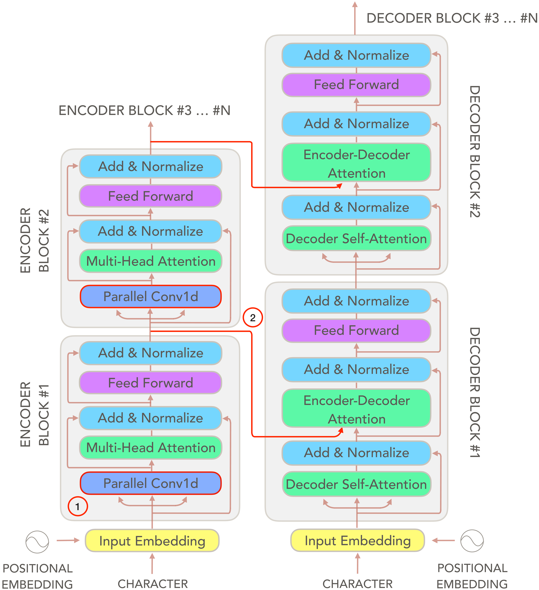

# A Convolutional Transformer for Character-Level Neural Machine Translation 

This file aims to provide a overall guidance of the code of the master thesis. The thesis was conducted during my stay at Institute of Neuroinformatics, ETH Zurich and University of Zurich, supervised by Prof.Dr.Richard Hahnloser, and advised by M.Sc. Nikola Nikolov and Yuhuang Hu. My sincere thanks to them all for everything in the last 6 month in Zurich. 

# Abstract

We propose a novel transformer-based architecture (Vaswani et al. in 2017) optimized  for  character-level  neural machine translation.  The model was entirely build on character-level inputs and thus requires no specific tokenizations. Our model modifies the encoder to contextualize the character representations by using parallel 1D convolutions.  To make

We perform extensive experiments  on  the  UN  dataset,  testing  both bilingual  and  multilingual  translation  to  English,  using up to three input languages (FR, ES and ZH). Our approach performs comparably or better than the base transformer, while being faster to converge and learning more robust character-level alignments, regardless of the input language. 

# Corpus

We test our model on two corpora:

- the WMT2015 German - English datasets
- the United Nations Parallel Corpus (UNPC)

The experiments are conducted in both bilingual and multilingual setting. For bilingual translation, we have only one source language as input, while for multilingual translation, we input a mixture of two or three source languages to the model. In all our experiments, English is chosen to be the target language.

We construct bilingual translation on WMT2015 as well as on UNPC corpus. For WMT2015 German - English translation, we utilize all parallel German - English sentence pairs of each individual dataset and construct a training set of 4.5 million sentence pairs, i.e. the same as the work proposed by Lee et. al in 2017.  For UNPC corpus, we perform French - English, Spanish - English and Chinese - English translation. Each of these bilingual language pair, we randomly sample 1 million sentence pairs to construct the training set, and use the test and valid set provided by the UNPC corpus. Noticed that although UNPC provides sentence-aligned corpora, we didn't created training sets that are sentence aligned, since the main goal of this thesis is not exploring the joint embedding space of all source languages.

The multilingual settings can be divided into close language pairs (i.e. French + Spanish - English) and distant language pairs (e.g. French + Chinese - English) from a linguistic point of view. The training sets of multilingual translation are shuffled mixtures of corresponding bilingual training sets, thus for multilingual translation with two source input languages, the training set contains 2 million sentence pairs, and so on. We construct the training sets for multilingual translation in such a way to prevent the model from overfitting one source language particularly.

The preprocessed data we used in the thesis can be found on Google Drive. 

# Preprocessing

### install fairseq

We implement our model based on the open-sourced fairseq project by FaceBook (Ott et al. in 2019). To install the fairseq repository, do the following:

```shell
cd /path/to/your/workspace/

git clone https://github.com/pytorch/fairseq.git

cd ./fairseq/

pip install -r requirements.txt % install dependencies

python setup.py build % build fairseq

python setup.py develop
```

### data cleaning

We use the Moses script to clean the data. The Moses tools are public available at https://github.com/moses-smt/mosesdecoder.git. We use the following scripts to clean the data:

``` shell
/mosesdecoder/scripts/tokenizer/remove-non-printing-char.perl

/mosesdecoder/scripts/tokenizer/tokenizer.perl

/mosesdecoder/scripts/training/clean-corpus-n.perl
```

### Convert Chinese texts to Wubi texts

To convert a text of raw Chinese characters into a text of correponding Wubi codes, run the following commands:

```shell
cd /path/to/your/workspace/convtransformer/

python convert_text.py --input-doc /path/to/the/chinese/text --output-doc /path/to/the/wubi/text --convert-type ch2wb
```

### Bilingual Training Sets

To construct training sets for bilingual translation, run the following commands (example for UNPC French - English):

```shell
cd /path/to/your/workspace/UN-corpora/
cd ./en-fr

paste -d'|' UNv1.0.en-fr.fr UNv1.0.en-fr.en | cat -n |shuf -n 1000000 | sort -n | cut -f2 > train.parallel`.fr-en

cut -d'|' -f1 train.parallel.fr-en > 1mil.train.fr-en.fr
cut -d'|' -f2 train.parallel.fr-en > 1mil.train.fr-en.en
```

### Multilingual Training Sets

To construct training sets for multilingual translation, run the following commands (example for UNPC French + Spanish - English):

```shell
cat train.parallel.fr-en train.parallel.es-en > concat.train.parallel.fres-en

shuf concat.train.parallel.fres-en > shuffled.train.parallel.fres-en

cut -d'|' -f1 shuffled.train.parallel.fres-en > 2mil.train.fres-en.fres
cut -d'|' -f2 shuffled.train.parallel.fres-en > 2mil.train.fres-en.en
```

### Data Binarization

The next step is to do data binarization of the data so we can directly train the model with the help of fairseq. Make sure you have `pytorch` installed before this step. Example for UNPC French + Spanish - English: 

``` shell
mkdir /path/to/your/workspace/all-data/UN-bin/multilingual/fres-en/test-fr/
mkdir /path/to/your/workspace/all-data/UN-bin/multilingual/fres-en/test-es/

cd /path/to/your/workspcae/convtransformer/
```

**evaluation on French input** 

```shell
python preprocess.py --source-lang fres --target-lang en \

--trainpref /path/to/your/workspace/all-data/UN-processed/multilingual/fres-en/test-fr/2mil.train.fres-en/ \

--validpref /path/to/your/workspace/all-data/UN-processed/multilingual/fres-en/test-fr/2mil.valid.fres-en/ \

--testpref /path/to/your/workspace/all-data/UN-processed/multilingual/fres-en/test-fr/2mil.test.fres-en/ \

--destdir /path/to/your/workspace/UN-bin/multilingual/fres-en/test-fr/ \ 

--nwordssrc 10000 --nwordstgt 10000 % choose number larger than at least 1000
```

**evaluation on Spanish input**

```shell
python preprocess.py --source-lang fres --targe-lang en \

--trainpref /path/to/your/workspace/all-data/UN-processed/multilingual/fres-en/test-es/2mil.train.fres-en/ \

--validpref /path/to/your/workspace/all-data/UN-processed/multilingual/fres-en/test-es/2mil.valid.fres-en/ \

--testpref /path/to/your/workspace/all-data/UN-processed/multilingual/fres-en/test-es/2mil.test.fres-en/ \

--destdir /path/to/your/workspace/UN-bin/multilingual/fres-en/test-es/ \

--nwordssrc 10000 --nwordstgt 10000
```

# Training

We train our models on the ETH Zurich Leonhard cluster. Each model was trained with 4 NVIDIA 1080x GPUs.  The models are trained with Adam optimizer and an adaptive learning rate adjusting method with warm-up learning rate initials. 

To submit jobs to the cluster, modify the file `convtransformer-run.sh` and `transformer-run.sh`correspondingly and do`bash convtransformer-run.sh`:

- `120:00` indicates the total training time. The maximal training time for one submission is 120 hours.  Submissions that require more than 120 training hours will be shut down by the cluster automatically after 120 hours.
- `mem=40000` indicates the total memory.  To be able to run the experiment successfully, please at lease ask for more than 40000 Bytes for memory.
- `ngpus_excl_p=4` specifies the number of GPUs that are required by the submission. We train all our models on 4 GPUs. 

To run the model on local GPUs, simply run

```shell
CUDA_VISIBLE_DEVICES=0,1,2,3 python train.py /cluster/scratch/username/UN-bin/multilingual/fres-en/test-fr/ \
--arch convtransformer --optimizer adam --adam-betas '(0.9, 0.98)' --clip-norm 0.0 \
--lr-scheduler inverse_sqrt --warmup-init-lr 1e-07 --warmup-updates 4000 --lr 0.0001 \
--min-lr 1e-09 --criterion label_smoothed_cross_entropy --label-smoothing 0.1 \
--weight-decay 0.0 --max-tokens 3000  \
--save-dir /cluster/scratch/username/checkpoints-conv-multi-fres-en/ \
--no-progress-bar --log-format simple --log-interval 2000 --allow_shortcut \
--find-unused-parameters --ddp-backend=no_c10d
```

where `--ddp-backend=no_c10d`  and `--find-unused-parameters` are crucial arguments to train the convtransformer model. One optional argument is `--allow_shortcut`,  which will enable the shortcut connections of the convtransformer. 

To train model on less than 4 GPUs, please specify the GPU in your computer that you want to use to train the model by setting `CUDA_VISIBLE_DEVICES` to the GPU actual index.

# Inference

We use again Moses script to compute the final BLEU points of the model. During the training, we store every checkpoint after one epoch is finished. We train models on WMT2015 up to 20 epochs and on UNPC up to 30 epochs.

### Evaluation on test set

As an example, to evaluate the test set, run `conv-multi-fres-en.sh ` to generate translation files of each individual checkpoint. To compute the BLEU point of one translation file, run:

```shell
cd /path/to/your/workspace/geneations/conv-multi-fres-en/
cd ./test-fr/

bash geneation_split.sh

rm -f generation_split.sh.sys generation_split.sh.ref 

mkdir split

mv generate*.out.sys ./split/
mv generate*.out.ref ./split/

cd ./split/

perl multi-bleu.perl generate30.out.ref < generate30.out.sys
```

For`generation_split.sh`, copy the following content into the shell:

```shell
#!/bin/bash

function split_generations ()
{
  for file in `ls $1`
  do
    if [ -d $1"/"$file ]
    then
      readfile $1"/"$file
    else
      #echo $1"/"$file
      grep ^T $1"/"$file | cut -f2- | perl -ple 's{(\S)-(\S)}{$1 ##AT##-##AT## $2}g' > $1"/"$file.ref
      grep ^H $1"/"$file |cut -f3- | perl -ple 's{(\S)-(\S)}{$1 ##AT##-##AT## $2}g' > $1"/"$file.sys
   echo `basename $file`
   fi
  done
}

folder=`pwd`
split_generations $folder 
```

### Evaluation on with manual input

To generate translation by manually inputting the sentence, run:

```shell
cd /path/to/your/workspace/convtransformer/

python interactive.py -source_sentence "Violación: uso de cloro gaseoso por el régimen sirio." \ 
-path_checkpoint "/path/to/your/workspace/checkpoints-conv-multi-fres-en/checkpoint30.pt" \
-data_bin "/path/to/your/workspace/UN-bin/multilingual/fres-en/test-es/"
```

This will print out the translation. 

# Analysis


